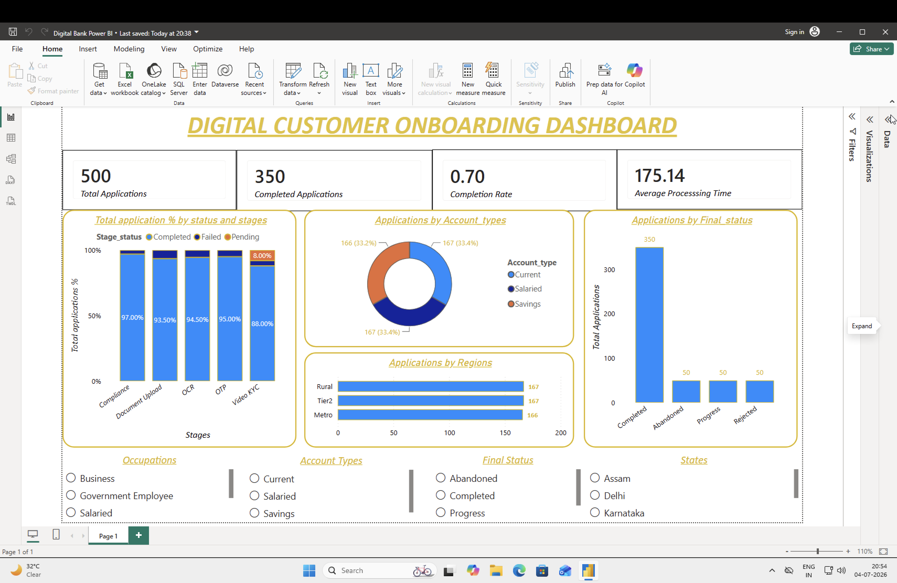

# Digital Customer Onboarding Analytics Dashboard

## Project Overview

This project analyzes the digital customer onboarding process of a retail bank to identify bottlenecks, reduce application abandonment, and improve customer experience.

The project was built using MySQL for database design and SQL analysis, followed by Power BI for dashboard visualization.

---

## Business Problem

Customers abandon online account opening due to OTP failures, document upload issues, OCR errors, verification delays, and compliance checks.

The objective was to identify the stages causing maximum drop-offs and recommend process improvements.

---

## Dashboard Preview

---

## Tools Used

- MySQL
- SQL
- Power BI
- DAX

---

## Database Design

The project consists of four related tables:

- Customers
- Applications
- Verifications
- Application Journey

---

## Dashboard KPIs

- Total Applications
- Completed Applications
- Completion Rate
- Average Processing Time

---

## Key Business Insights

- Digital onboarding performance can be monitored using final status-level analysis.
- Verification stages contribute significantly to processing delays.
- Regional and account-type trends help identify customer behavior.
- Interactive filters allow management to monitor operational performance.

---

## Business Recommendations

- Improve OTP delivery reliability.
- Reduce manual verification using better OCR.
- Simplify document upload instructions.
- Automate repetitive verification checks.
- Monitor onboarding KPIs through interactive dashboards.
